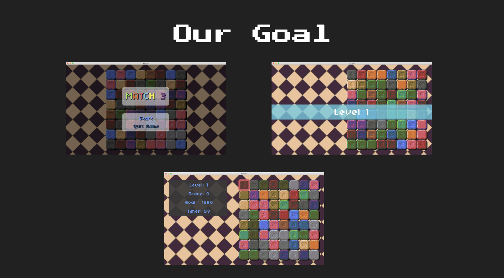
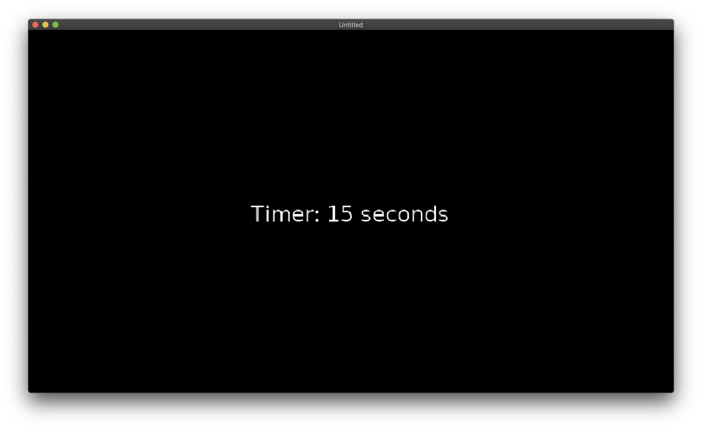
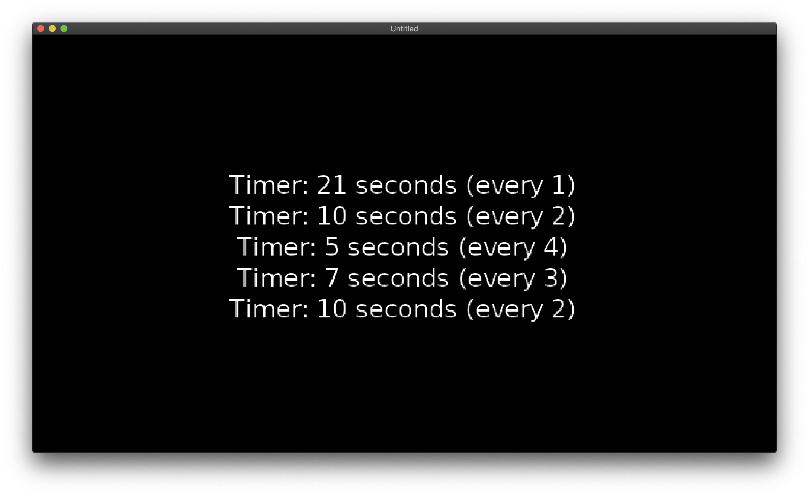

# GD50-match3

## Overview:

### Summary:

-   **Anonymous Functions:**  
    A fundamental concept in many dynamic languages, as well as Lua. Anonymous functions are functions that are first class, meaning that they operate as data types.

-   **Tweening:**  
    Interpolating a value between two values over time. Useful for asynchronous behavior and asynchronous variable manipulation.

-   **Timers**
-   **Solving Matches**
-   **Procedural Grids**
-   **Sprite Art and Palettes**

### Goal:

 
 

## Developing & Learning Notes:

### timer0: "The Simple Way"

-   **Pseudocode:**
    -   In love.load()
        -   Create timer variable
        -   Create counter variable
    -   In love.update(dt)
        -   Increment timer variable by dt
        -   If timer > 1
            -   Increment counter by 1
            -   Take remainers of timer
        -   End if
    -   In love.draw()
        -   Render and print counter variable

#### Results:

 

### timer1: "The Ugly Way"

-   Do the above 5 times

 

### timer2: "The Clean Way"

Need to include the "Timer" library or module

-   Timer.every(internal, callback)
-   Timer.after(interval, callback)

-   **Pseudocode:**
    -   In love.load()
        -   Create table of intervals
        -   Create table of counters
        -   for each interval value in table
            -   Timer.every() increment counter at same index
            -   loop
    -   In love.update(dt)
        -   Do nothing
    -   In love.draw()
        -   for each counter value in table
            -   draw
            -   loop

#### Results:

 

### tween0: "The Simple Way"

-   Lua Trick: Assign 2 values to two variables using a comma

        flappyX, flappyY = 0, VIRTUAL_HEIGHT / 2 - 8

-   Make use of a timer and the ratio of (timer / MOVE_INTERVAL) to achieve  discrete but very accurate result of dividing steps within an interval period of time

        flappyX = math.min(endX, endX * (timer / MOVE_DURATION))

-   

### tween1
### tween2
### chain0
### chain1
### match-3
### swap0
### swap1
### swap2

# Assignment 3

\-- Enter Description Here...

Final Submission:

\-- Enter Description Here...

## Helpful Links:
- [GitHub: Mastering Markdown](https://guides.github.com/features/mastering-markdown/)
