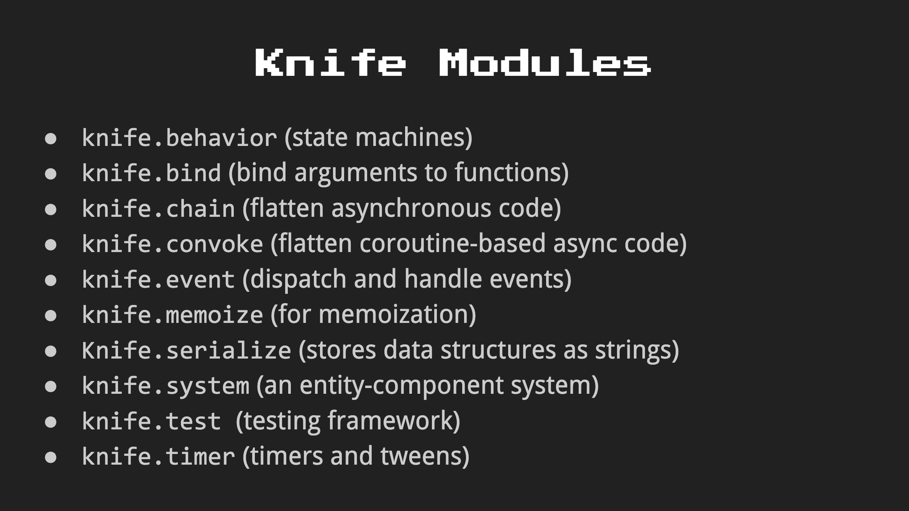
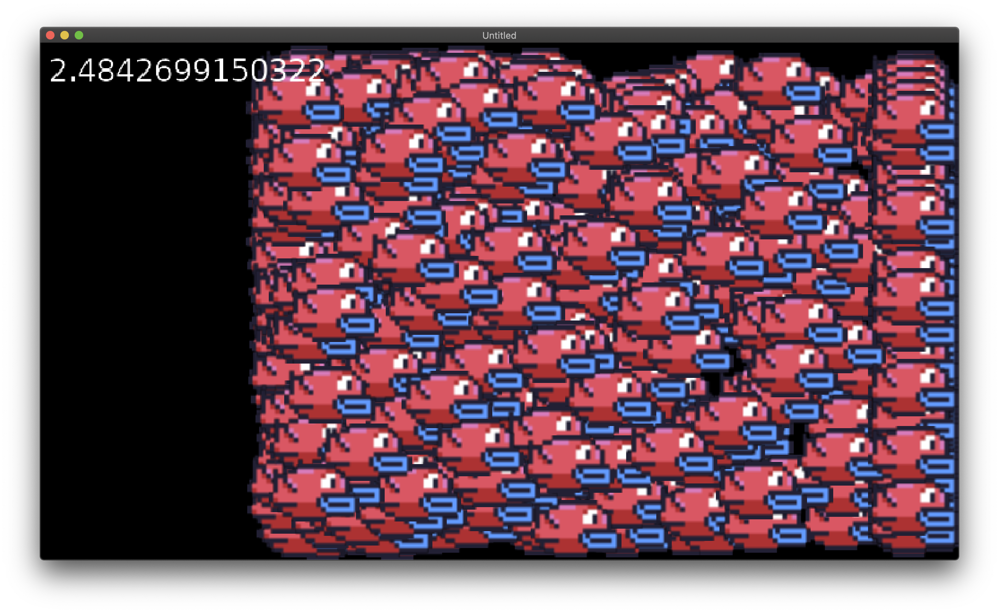
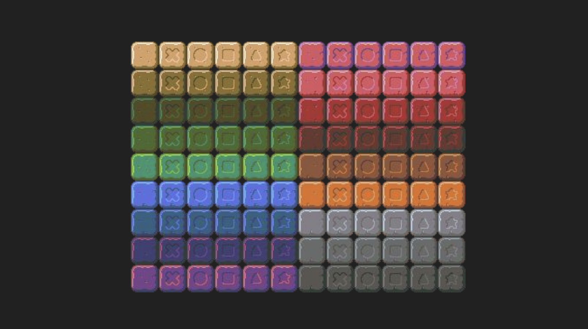

# GD50-match3

## Overview:

### Summary:

-   **Anonymous Functions:**  A fundamental concept in many dynamic languages, as well as Lua. Anonymous functions are functions that are first class, meaning that they operate as data types.
-   **Tweening:**  Interpolating a value between two values over time. Useful for asynchronous behavior and asynchronous variable manipulation.
-   **Timers**
-   **Solving Matches**
-   **Procedural Grids**
-   **Sprite Art and Palettes**


### Goal:


<br>
<br>

## Developing & Learning Notes:

### timer0: "The Simple Way"

-   **Pseudocode:**
    -   In love.load()
        -   Create timer variable
        -   Create counter variable
    -   In love.update(dt)
        -   Increment timer variable by dt
        -   If timer > 1
            -   Increment counter by 1
            -   Take remainers of timer
        -   End if
    -   In love.draw()
        -   Render and print counter variable


#### Results:


<br>

### timer1: "The Ugly Way"

-   Do the above 5 times with different interval values

<br>

### timer2: "The Clean Way"

Need to include the "Timer" library or module

-   Timer.every(internal, callback)
-   Timer.after(interval, callback)


-   **Pseudocode:**
    -   In love.load()
        -   Create table of intervals
        -   Create table of counters
        -   for each interval value in table
            -   Timer.every() increment counter at same index
        -   Loop
    -   In love.update(dt)
        -   Do nothing
    -   In love.draw()
        -   for each counter value in table
            -   draw
        -   Loop


#### Results:


<br>

### tween0: "The Simple Way"


-   Lua Trick: Assign 2 values to two variables using a comma

        flappyX, flappyY = 0, VIRTUAL_HEIGHT / 2 - 8


-   Make use of a timer and the ratio of (timer / MOVE_INTERVAL) to achieve  discrete but very accurate result of dividing steps within an interval period of time

    ```lua
    flappyX = math.min(endX, endX * (timer / MOVE_DURATION))
    ```

### tween1: "A Better Way"


-   Knife Library  

    


-   Again, put them all in table


-   **Pseudocode:**
    -   In love.load()
        -   Create timer
        -   Initiate empty flappy bird table
        -   for x amount of times
            -   Insert into table a bird with a random rate (see below for random rate)
        -   Loop
    -   In love.update(dt)
        -   If timer less than TIMER_MAX
            -   Update timer with dt
            -   for each bird
                -   Update position with the above (timer / rate) ratio
            -   Loop


-   For random floats in Lua and Love2d:

        rate = math.random() + math.random(TIMER_MAX - 1)


-   Stress test the game with love.timer.getFPS() and ramp up the number of flappy birds


#### Results:  



### tween2: "The Timer.tween Way"

-   Opacity:

    ```lua
    love.graphics.setColor(255, 255, 255, bird.opacity)
    ```

-   Now start bird.opacity at 0
-   Then change opacity and also position for each bird with bird.rate (you can pass as many parameters in and also as many entities in as you like, POWERFUL. Refer to knife documentations)

    ```lua
    for k, bird in pairs(birds) do
        Timer.tween(bird.rate, {
            [bird] = { x = endX, opacity = 255 }
        })
    end
    ```

-   For example a translation screen:
    -   Draw rectangle that is the screen size and tween its opacity from 0 to 255
    -   Enter next game state
    -   Draw same rectangle but tween its opacity from 255 to 0
    -   Can be any colour you like


-   In match-3 source code, as an example to achieve multicolour flashing alphabets

    ```lua
    self.colors = {
        [1] = {217, 87, 99, 255},
        [2] = {95, 205, 228, 255},
        [3] = {251, 242, 54, 255},
        [4] = {118, 66, 138, 255},
        [5] = {153, 229, 80, 255},
        [6] = {223, 113, 38, 255}
    }

    self.letterTable = {
        {'M', -108},
        {'A', -64},
        {'T', -28},
        {'C', 2},
        {'H', 40},
        {'3', 112}
    }

    self.colorTimer = Timer.every(0.075, function()
        -- shift every color to the next, looping the last to front
        -- assign it to 0 so the loop below moves it to 1, default start
        self.colors[0] = self.colors[6]

        for i = 6, 1, -1 do
            self.colors[i] = self.colors[i - 1]
        end
    end)
    ```

-   Also an example for **manipulating [self]** and using a **finish function**

    ```lua
    Timer.tween(1, {
        [self] = {transitionAlpha = 255}
    }):finish(function()
        gStateMachine:change('begin-game', {
            level = 1
        })
    ```


### chain0: "The Simple (and Hard... and Ugly) Way"
Concept of chaining things together, for instance where you have a cutscene with a character walk from point to point, talk to someone, with dialogue box, then do something else... These are consecutive, predetermind chain of events/actions to be performed by the game.

-   **Pseudocode:**
    -   In love.laod()
        -   Initial position as base position
        -   Create timer
        -   Table of destinations
        -   for each destinations in table
            -   Add a reached key
        -   Loop
    -   In love.update(dt)
        -   Increment timer
        -   for each destination in table
            - if nor reached
                -   Use base position for transitional movement (tweening)
                -   if at max time
                    -   Flag destination reached
                    -   Set current Position as base position
                    -   Reset timer
                -   end if
                -   break to next destination
            -   end if
        -   Loop


-   Trick for never going over the max time

    ```lua
    timer = math.min(MOVEMENT_TIME, timer + dt)
    ```

### chain1: "The Better Way"

-   Using Knife module of Timer.tween:finish(), issue is, you get this nested loop as below:

    ```lua
    Timer.tween(MOVEMENT_TIME, {
        [flappy] = {x = VIRTUAL_WIDTH - flappySprite:getWidth(), y = 0}
    })
    :finish(function()
        Timer.tween(MOVEMENT_TIME, {
            [flappy] = {x = VIRTUAL_WIDTH - flappySprite:getWidth(), y = VIRTUAL_HEIGHT - flappySprite:getHeight()}
        })
        :finish(function()
            Timer.tween(MOVEMENT_TIME, {
                [flappy] = {x = 0, y = VIRTUAL_HEIGHT - flappySprite:getHeight()}
            })
            :finish(function()
                Timer.tween(MOVEMENT_TIME, {
                    [flappy] = {x = 0, y = 0}
                })
            end)
        end)
    end)
    ```


### swap0: "Just A Board"

#### Sprite Sheet:  


-   Table inside a table inside a table
    -   Row Table
        -   Colume Table
            -   Property Table


### swap1: "The Static Swap"

-   Swap with middle man


### swap2: "The Tween Swap"

-   Apply Tween

### match-3

-   Check Matching
    -   Iterate Rows to find hrizontal match
    -   Iterate Columns to find vertical match
    -   Add matches into a match table

-   Remove Matches
    -   Set matches tiles to nil

-   Move Tiles
    -   Start from bottom, if nil look above
    -   If tile fonud, move it down (tween)
    -   Iterate through Columns

-   Repalce Tiles
    -   Iterate Columns to see how many tiles need to be generated
    -   Tween new tiles to correct positions


<br>

# Assignment 3

## Objectives
-   [x] **Materials:** Read and understand all of the Match-3 source code from Lecture 3.
-   [x] **Time Addition on Matches:** Implement time addition on matches, such that scoring a match extends the timer by 1 second per tile in a match.
-   [x] **Advanced Levels:** Ensure Level 1 starts just with simple flat blocks (the first of each color in the sprite sheet), with later levels generating the blocks with patterns on them (like the triangle, cross, etc.). These should be worth more points, at your discretion.
-   [x] **The Shiny One:** Creat random shiny versions of blocks that will destroy an entire row on match, granting points for each block in the row.
-   [x] **Swap On Matches Only:** Only allow swapping when it results in a match. If there are no matches available to perform, reset the board.
-   [ ] **Mouse Control (Optional):** Implement matching using the mouse. (Hint: you’ll need push:toGame(x,y); see the push library’s documentation [here](https://github.com/Ulydev/push) for details!


<br>   

### Time Addition on Matches
Implement time addition on matches, such that scoring a match extends the timer by 1 second per tile in a match. This one will probably be the easiest! Currently, there’s code that calculates the amount of points you’ll want to award the player when it calculates any matches in PlayState:calculateMatches, so start there!


- Simple

    ```lua
    function PlayState:calculateMatches(x, y)

        local matches = self.board:calculateMatches()

        if matches then
            self.highlightedTile = nil
            gSounds['match']:stop()
            gSounds['match']:play()

            -- add score for each match
            for k, match in pairs(matches) do
                local totalBonus = 0
                local bonus = 0

                for i = 1, #match do

                    if match[i].variety > 1 and match[i].variety < 5 then
                        bonus = 1.1
                    elseif match[i].variety == 5 then
                        bonus = 1.2
                    elseif match[i].variety == 6 then
                        bonus = 1.3
                    end

                    if match[i].isShiny then
                        bonus = 5
                    end

                totalBonus = totalBonus + bonus * BASE_SCORE

            end

                self.score = self.score + #match * BASE_SCORE + totalBonus
                self.timer = self.timer + #match * 1
            end

            self.board:removeMatches()
        end
        ...
    end
    ```

<br>

### Advanced Levels
Ensure Level 1 starts just with simple flat blocks (the first of each color in the sprite sheet), with later levels generating the blocks with patterns on them (like the triangle, cross, etc.). These should be worth more points, at your discretion. This one will be a little trickier than the last step (but only slightly); right now, random colors and varieties are chosen in Board:initializeTiles, but perhaps we could pass in the level variable from the PlayState when a Board is created (specifically in PlayState:enter), and then let that influence what variety is chosen?

-   Decrease total number of colours appears
    -   I like: 1, 4, 6, 7, 13, 16
-   Decrease total number of variety appears
    -   I like: 1, 5, 6
-   Basically create table of above numbers, and when generate new tiles, math random the length of above tables.
-   Pass the above tables into Board initialisation base current level
-   When calculate matches, iterate through each match for  all tiles, get their variety and apply bonus.

    ```lua
    function PlayState:enter(params)
        -- grab level # from the params we're passed
        self.level = params.level

        -- spawn a board and place it toward the right
        self.board = params.board or Board(VIRTUAL_WIDTH - 272, 16, {1, 4, 6, 7, 13, 16}, {1, 5, 6})

        -- grab score from params if it was passed
        self.score = params.score or 0

        -- score we have to reach to get to the next level
        self.scoreGoal = self.level * 1.25 * 1000
    end
    ```

<br>  

### The Shiny One
Create random shiny versions of blocks that will destroy an entire row on match, granting points for each block in the row. This one will require a little more work! We’ll need to modify the Tile class most likely to hold some kind of flag to let us know whether it’s shiny and then test for its presence in Board:calculateMatches!

-   Add isShiny property
-   Randomly generate a shiny block
-   Add Highlight for shiny block
-   When clear, clear entire row

    ```lua
    function Board:removeMatches()

        for k, match in pairs(self.matches) do
            for k, tile in pairs(match) do
                if tile.isShiny then
                    for i = 1, 8 do
                        self.tiles[tile.gridY][i] = nil
                    end
                end
                self.tiles[tile.gridY][tile.gridX] = nil
            end
        end
        self.matches = nil

    end
    ```

<br>  

### Swap On Matches Only
Only allow swapping when it results in a match. If there are no matches available to perform, reset the board. There are multiple ways to try and tackle this problem; choose whatever way you think is best! The simplest is probably just to try and test for Board:calculateMatches after a swap and just revert back if there is no match! The harder part is ensuring that potential matches exist; for this, the simplest way is most likely to pretend swap everything left, right, up, and down, using essentially the same reverting code as just above! However, be mindful that the current implementation uses all of the blocks in the sprite sheet, which mathematically makes it highly unlikely we’ll get a board with any viable matches in the first place; in order to fix this, be sure to instead only choose a subset of tile colors to spawn in the Board (8 seems like a good number, though tweak to taste!) before implementing this algorithm!

-   Make swapTiles() a function of PlayState
-   At the end of swapTiles(), run PlayState:calculateMatches()
-   When no match is found, run swapTiles() again, this time revert the swapping process
-    In order to revert the swapping process, the tempX and tempY used previously can be kept and passed in

    ```lua
    function PlayState:swapTiles(x, y)

        local tempX = self.highlightedTile.gridX
        local tempY = self.highlightedTile.gridY

        local newTile = self.board.tiles[y][x]

        self.highlightedTile.gridX = newTile.gridX
        self.highlightedTile.gridY = newTile.gridY
        newTile.gridX = tempX
        newTile.gridY = tempY

        -- swap tiles in the tiles table
        self.board.tiles[self.highlightedTile.gridY][self.highlightedTile.gridX] =
            self.highlightedTile

        self.board.tiles[newTile.gridY][newTile.gridX] = newTile

        -- tween coordinates between the two so they swap
        Timer.tween(0.2, {
            [self.highlightedTile] = {x = newTile.x, y = newTile.y},
            [newTile] = {x = self.highlightedTile.x, y = self.highlightedTile.y}
        })
        -- once the swap is finished, we can tween falling blocks as needed
        :finish(function()
            self:calculateMatches(tempX, tempY)
        end)

    end
    ```

-   Keep track of variables like self.highlightedTile etc
-   Swap animation (tween) made longer in order for player to understand what has happened


<br>  

### Mouse Control
(Optional) Implement matching using the mouse. (Hint: you’ll need push:toGame(x,y); see the push library’s documentation here for details! This one’s fairly self-explanatory; feel free to implement click-based, drag-based, or both for your application! This one’s only if you’re feeling up for a bonus challenge :) Have fun!


Final Submission:

\-- Enter Description Here...

## Helpful Links:
-   [Lua Knife](https://github.com/airstruck/knife)
-   [GitHub: Mastering Markdown](https://guides.github.com/features/mastering-markdown/)
